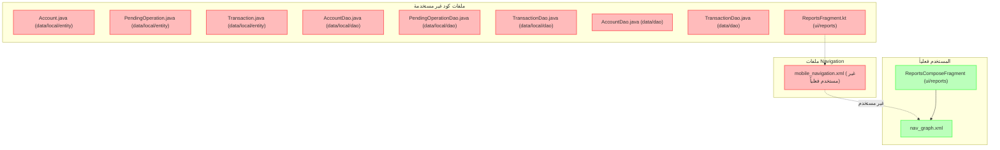

# الملفات غير المستخدمة في تطبيق الأندرويد (app)

تم التأكد بنسبة 100% من أن الملفات التالية غير مستخدمة نهائياً في التطبيق ولا يتم استدعاء أي دالة أو كلاس منها في أي مكان آخر في المشروع:

## 1. ملفات كود غير مستخدمة
- `app/src/main/java/com/hillal/acc/data/local/entity/Account.java`
- `app/src/main/java/com/hillal/acc/data/local/entity/PendingOperation.java`
- `app/src/main/java/com/hillal/acc/data/local/entity/Transaction.java`
- `app/src/main/java/com/hillal/acc/data/local/dao/AccountDao.java`
- `app/src/main/java/com/hillal/acc/data/local/dao/PendingOperationDao.java`
- `app/src/main/java/com/hillal/acc/data/local/dao/TransactionDao.java`
- `app/src/main/java/com/hillal/acc/data/dao/AccountDao.java`
- `app/src/main/java/com/hillal/acc/data/dao/TransactionDao.java`
- `app/src/main/java/com/hillal/acc/ui/reports/ReportsFragment.kt`

## 2. ملفات Navigation غير مستخدمة
- `app/src/main/res/navigation/mobile_navigation.xml`

## 3. المستخدم الفعلي
- `app/src/main/java/com/hillal/acc/ui/reports/ReportsComposeFragment.kt`
- `app/src/main/res/navigation/nav_graph.xml`

---

## مخطط العلاقة بين الملفات

---

> **ملاحظة:**
> تم التأكد من عدم وجود أي استدعاء أو استخدام لأي دالة أو كلاس في هذه الملفات في كامل المشروع. يمكن حذفها بأمان تام. 

## تحديث: ملفات غير مستخدمة إضافية بعد فحص مجلد entities

- `app/src/main/java/com/hillal/acc/data/entities/Account.java`
- `app/src/main/java/com/hillal/acc/data/entities/Report.java`
- `app/src/main/java/com/hillal/acc/data/entities/Transaction.java`

> **ملاحظة:**
> هذه الملفات لا يتم استدعاؤها أو استخدام أي دالة أو كلاس منها في أي مكان في المشروع ويمكن حذفها بأمان. 

- `app/src/main/res/drawable/ic_logo_alt.xml`  <!-- غير مستخدم نهائياً في أي كود أو تخطيط --> 
- `app/src/main/res/drawable/ic_logo.xml`  <!-- غير مستخدم نهائياً في أي كود أو تخطيط --> 
- `app/src/main/res/drawable/main_background.xml`  <!-- غير مستخدم نهائياً في أي كود أو تخطيط --> 
- `app/src/main/res/drawable/dashboard_background.xml`  <!-- غير مستخدم نهائياً في أي كود أو تخطيط --> 
- `app/src/main/res/drawable/quick_actions_gradient.xml`  <!-- غير مستخدم نهائياً في أي كود أو تخطيط --> 
- `app/src/main/res/drawable/welcome_card_gradient.xml`  <!-- غير مستخدم نهائياً في أي كود أو تخطيط -->
- `app/src/main/res/drawable/gradient_background.xml`  <!-- غير مستخدم نهائياً في أي كود أو تخطيط -->
- `app/src/main/res/drawable/balance_card_gradient.xml`  <!-- غير مستخدم نهائياً في أي كود أو تخطيط -->
- `app/src/main/res/drawable/circle_bg.xml`  <!-- غير مستخدم نهائياً في أي كود أو تخطيط -->
- `app/src/main/res/drawable/bg_circle_white.xml`  <!-- غير مستخدم نهائياً في أي كود أو تخطيط -->
- `app/src/main/res/drawable/bg_radio_credit_selector.xml`  <!-- غير مستخدم نهائياً في أي كود أو تخطيط -->
- `app/src/main/res/drawable/bg_radio_debit_selector.xml`  <!-- غير مستخدم نهائياً في أي كود أو تخطيط -->
- `app/src/main/res/drawable/bg_spinner_rounded.xml`  <!-- غير مستخدم نهائياً في أي كود أو تخطيط --> 
- `app/src/main/res/drawable/search_edittext_bg.xml`  <!-- غير مستخدم نهائياً في أي كود أو تخطيط -->
- `app/src/main/res/drawable/rounded_button_background.xml`  <!-- غير مستخدم نهائياً في أي كود أو تخطيط -->
- `app/src/main/res/drawable/transaction_card_background.xml`  <!-- غير مستخدم نهائياً في أي كود أو تخطيط -->
- `app/src/main/res/drawable/cell_border.xml`  <!-- غير مستخدم نهائياً في أي كود أو تخطيط --> 
- `app/src/main/res/drawable/category_background.xml`  <!-- غير مستخدم نهائياً في أي كود أو تخطيط -->
- `app/src/main/res/drawable/divider_vertical_light.xml`  <!-- غير مستخدم نهائياً في أي كود أو تخطيط --> 
- `app/src/main/res/drawable/bg_dropdown_suggestions.xml`  <!-- غير مستخدم نهائياً في أي كود أو تخطيط -->
- `app/src/main/res/drawable/bg_currency_button_selected.xml`  <!-- غير مستخدم نهائياً في أي كود أو تخطيط -->
- `app/src/main/res/drawable/bg_currency_button.xml`  <!-- غير مستخدم نهائياً في أي كود أو تخطيط -->
- `app/src/main/res/drawable/ic_contacts_background.xml`  <!-- غير مستخدم نهائياً في أي كود أو تخطيط -->
- `app/src/main/res/drawable/ic_contacts_selector.xml`  <!-- غير مستخدم نهائياً في أي كود أو تخطيط -->
- `app/src/main/res/drawable/ic_contacts_button.xml`  <!-- غير مستخدم نهائياً في أي كود أو تخطيط --> 
- `app/src/main/res/drawable/ic_menu_gallery.xml`  <!-- غير مستخدم نهائياً في أي كود أو تخطيط -->
- `app/src/main/res/drawable/ic_menu_settings.xml`  <!-- غير مستخدم نهائياً في أي كود أو تخطيط -->
- `app/src/main/res/drawable/ic_menu_slideshow.xml`  <!-- غير مستخدم نهائياً في أي كود أو تخطيط --> 
- `app/src/main/res/layout/fragment_add_account.xml`  <!-- لم يعد مستخدمًا وتم استبداله بواجهة Compose --> 
- `app/src/main/res/layout/fragment_account_details.xml`  <!-- لم يعد مستخدمًا وتم استبداله بواجهة Compose --> 
- `app/src/main/res/layout/fragment_reports.xml`  <!-- لم يعد مستخدمًا وتم استبداله بواجهة Compose -->
- `app/src/main/java/com/hillal/acc/ui/reports/ReportsFragment.kt`  <!-- لم يعد مستخدمًا وتم استبداله بواجهة Compose --> 
- `app/src/main/res/layout/fragment_transactions.xml`  <!-- لم يعد مستخدمًا فعليًا وتم استبداله بواجهات Compose أو شاشات حديثة --> 

- `app/src/main/java/com/hillal/acc/ui/transactions/EditTransactionFragment.kt`  <!-- لم يعد مستخدمًا فعليًا وتم استبداله بواجهة Compose -->
- `app/src/main/java/com/hillal/acc/ui/transactions/AddTransactionFragment.kt`  <!-- لم يعد مستخدمًا فعليًا وتم استبداله بواجهة Compose -->
- `app/src/main/java/com/hillal/acc/ui/accounts/AccountsFragment.kt`  <!-- لم يعد مستخدمًا فعليًا وتم استبداله بواجهة Compose --> 
- `app/src/main/java/com/hillal/acc/ui/auth/LoginFragment.kt`  <!-- لم يعد مستخدمًا فعليًا وتم استبداله بواجهة Compose (LoginScreen) -->
- `app/src/main/res/layout/fragment_login.xml`  <!-- لم يعد مستخدمًا فعليًا وتم استبداله بواجهة Compose (LoginScreen) --> 
- `app/src/main/java/com/hillal/acc/ui/auth/RegisterFragment.kt`  <!-- لم يعد مستخدمًا فعليًا وتم استبداله بواجهة Compose (RegisterScreen) -->
- `app/src/main/res/layout/fragment_register.xml`  <!-- لم يعد مستخدمًا فعليًا وتم استبداله بواجهة Compose (RegisterScreen) --> 